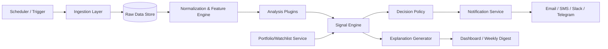

# Market-Morning Loss-Review Bot Architecture

You’re building a bot that:
1) pulls recent Yahoo Finance data,  
2) explains “what happened last week,”  
3) tracks your watchlist/positions, and  
4) sends notifications when buy-opportunity conditions are met.

The design below keeps this easy to extend as you add more analysis modules over time.

---

## 1) High-level architecture



---

## 2) Core modules (extensible by design)

### A) Data Ingestion
- **Yahoo Source Adapter** (`yahoo_adapter`)
- Pull:
  - weekly OHLCV + historical close
  - latest quotes
  - company profile/sector/market cap
  - optional news/headlines
- Normalize to a single schema (`symbol, ts, open, high, low, close, volume, source, metadata`).
- **Failure mode handling:** retries, stale-data checks, and source fallback.

### B) Storage
- **Raw layer**: append-only market snapshots for reproducibility.
- **Computed layer**: derived features (`pct_change_1d`, `pct_change_1w`, `rsi_14`, etc.).
- **Signals layer**: every analysis output with score, confidence, timestamp, rationale.
- Suggestion:
  - MVP: SQLite/duckdb + local parquet
  - Scale: PostgreSQL + S3/MinIO for snapshots

### C) Analysis Engine (Plugin System)
Define a plugin interface:
- `analyze(df, context, cfg) -> List[Insight]`
- Each analysis module returns:
  - `type` (momentum, trend, volume, volatility, event)
  - `score` (e.g., -1 to +1)
  - `confidence`
  - `rationale` (structured + human text)
- Suggested starter plugins:
  - `weekly_return`
  - `trend_strength`
  - `gap_and_momentum`
  - `news_impact` (optional, conservative)
  - `risk_regime` (volatility regime filter)
- New modules can be added by dropping a new plugin file and registering it.

### D) Signal/Decision Engine
- Input: market insights + portfolio context.
- Portfolio context includes:
  - holdings by symbol
  - buy price, position size, stop thresholds
  - max exposure per sector/capital
- Output:
  - `BUY`, `HOLD`, `WAIT`, or `RISK OFF`
  - explicit score reason + “what changed this week” summary.
- Important: default behavior should be **informational**, not execute orders automatically.

### E) Notification Service
- Supports channels:
 - Telegram
 - Email
 - Slack / Discord
- Contains throttling + dedup so you don’t get repeat “buy” noise.
- Templates:
 - “Weekly recap”
 - “Watchlist anomaly”
 - “Buy candidate generated”

### F) Weekly Explainability Reporter
- Produces a concise narrative:
  - Top movers (up/down)
  - Volume/volatility changes
  - Market regime summary
  - Position-by-position explanation (why your holdings moved)
  - Open risks for next week

### G) Guardrails
- No trading execution by default.
- Add explicit pre-checks before any action:
  - data freshness check
  - confidence threshold
  - drawdown filter
  - position cap
  - circuit-breaker if API failures exceed threshold

---

## 3) Suggested project structure

```text
market-bot/
  ├─ src/
  │  ├─ app/
  │  │  ├─ config.py
  │  │  ├─ orchestrator.py          # weekly job + hourly signal checks
  │  │  └─ api.py                   # optional internal dashboard endpoints
  │  ├─ data/
  │  │  ├─ scheduler.py
  │  │  ├─ adapters/
  │  │  │  └─ yahoo.py
  │  │  ├─ models.py                # pydantic/dataclass schemas
  │  │  └─ storage.py
  │  ├─ analysis/
  │  │  ├─ plugin_base.py
  │  │  ├─ registry.py
  │  │  ├─ weekly_return.py
  │  │  ├─ momentum.py
  │  │  ├─ volatility.py
  │  │  └─ news.py
  │  ├─ portfolio/
  │  │  ├─ watchlist.py
  │  │  └─ positions.py
  │  ├─ decision/
  │  │  ├─ engine.py
  │  │  └─ policies.py
  │  ├─ report/
  │  │  ├─ explainability.py
  │  │  └─ templates.py
  │  ├─ notify/
  │  │  ├─ base.py
  │  │  ├─ email.py
  │  │  └─ telegram.py
  │  └─ main.py
  ├─ configs/
  │  ├─ default.yaml
  │  ├─ notify.yaml
  │  └─ risk.yaml
  ├─ data/
  │  ├─ raw/
  │  └─ features/
  ├─ tests/
  ├─ .env.example
  ├─ requirements.txt
  └─ docker-compose.yml
```

---

## 4) Weekly “what happened” flow

1. Scheduler triggers weekly job (e.g., every Monday 09:00 local).
2. Pull last 7–10 days of data for watchlist + benchmark.
3. Compute deltas, moving averages, volume shifts, and volatility.
4. Run each analysis plugin.
5. Decision engine scores each holding and nearby sectors.
6. Explainability service turns findings into plain-language summary.
7. Send digest + per-symbol notes.

---

## 5) “When should I buy?” design

- For safety, treat all outputs as **signals, not advice**.
- Create a composite score formula:
  - `trend_score (30%)`
  - `momentum_score (25%)`
  - `volatility_score (20%)`
  - `fundamental_score (10–25% if added later)`
  - `confidence_adjustment (- penalty if conflicting signals)`
- Trigger example:
  - `BUY_CANDIDATE` when score > 0.75, confidence > 0.70, and risk checks pass.
- Add cooldowns:
  - Don’t re-alert same symbol within 24h unless severity increased.
  - Require at least 2 independent strong indicators for high-confidence buy.

---

## 6) MVP vs. v2 roadmap

- **MVP (week 1–2):**
  - Yahoo ingestion
  - weekly return + trend plugins
  - watchlist-specific summary
  - Telegram/email digest
- **v2:**
  - Sector and benchmark-relative insights
  - risk score + correlation checks
  - backtests for each signal strategy
  - small LLM-based natural language report
- **v3:**
  - plugin marketplace for indicators
  - advanced event sentiment
  - multi-portfolio support

---

## 7) Practical next actions

If you want, I can now scaffold this as runnable code in this repo:
- `requirements.txt` + package structure
- a mock Yahoo ingestion service
- plugin base + two starter plugins
- weekly report + notification job
- `.env` config and minimal tests

